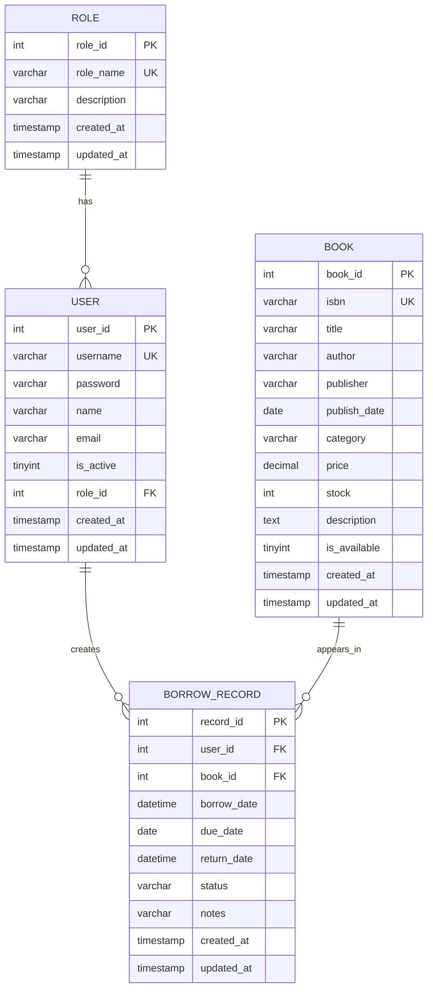

# 图书管理系统

这是一个用于数据库设计课程作业的图书管理系统。项目采用前后端分离结构，后端使用 Spring Boot 3、Spring Security、JWT、MyBatis-Plus 和 MySQL，前端使用 Vue 3、Vite、Element Plus、Vue Router、Pinia 和 Axios。

本 README 优先说明环境依赖、安装验证、配置文件、首次启动和后续启动流程。完成这些步骤后，再阅读项目功能、数据库设计、接口和后续优化建议。

## 1. 环境依赖

### 1.1 必需软件

| 依赖 | 建议版本 | 用途 |
|---|---:|---|
| JDK | 17 | 编译和运行 Spring Boot 后端 |
| Maven | 3.8+ | 管理后端依赖、构建后端项目 |
| MySQL | 8.0+ | 存储用户、角色、图书、借阅记录 |
| Node.js | 18+ | 运行前端开发环境 |
| npm | 9+ | 安装前端依赖、运行前端脚本 |
| Git | 可选 | 克隆或管理项目代码 |

### 1.2 安装方式

#### JDK 17

推荐安装 Temurin JDK 17、Oracle JDK 17 或 Microsoft Build of OpenJDK 17。

Windows 可使用安装包，也可使用 winget：

```powershell
winget install EclipseAdoptium.Temurin.17.JDK
```

安装后检查：

```powershell
java -version
javac -version
```

正常情况下应看到 `17` 开头的版本号。

如果命令无法识别，需要配置 `JAVA_HOME`，并将 `%JAVA_HOME%\bin` 加入 `Path`。

#### Maven

可从 Maven 官网下载压缩包，解压后配置环境变量：

- `MAVEN_HOME` 指向 Maven 解压目录
- 将 `%MAVEN_HOME%\bin` 加入 `Path`

也可以使用 winget：

```powershell
winget install Apache.Maven
```

安装后检查：

```powershell
mvn -version
```

正常情况下应看到 Maven 版本，并且 Java version 为 17。

#### MySQL 8

推荐安装 MySQL Community Server 8.0。

Windows 可使用 MySQL Installer，也可使用 winget：

```powershell
winget install Oracle.MySQL
```

安装时请记住 root 用户密码，后面需要写入后端配置文件。

安装后检查：

```powershell
mysql --version
mysql -u root -p -e "SELECT VERSION();"
```

第二条命令会要求输入 MySQL 密码，成功后会显示 MySQL 版本。

如果 `mysql` 命令无法识别，需要把 MySQL 的 `bin` 目录加入 `Path`，常见路径类似：

```text
C:\Program Files\MySQL\MySQL Server 8.0\bin
```

#### Node.js 和 npm

推荐安装 Node.js 18 LTS 或更新的 LTS 版本。npm 会随 Node.js 一起安装。

Windows 可使用安装包，也可使用 winget：

```powershell
winget install OpenJS.NodeJS.LTS
```

安装后检查：

```powershell
node -v
npm -v
```

正常情况下 Node.js 版本应为 `v18` 或更高。

#### Git

如果项目已经在本地，可以不安装 Git。若需要克隆代码，安装后检查：

```powershell
git --version
```

## 2. 项目目录

```text
book/
|-- backend/    Spring Boot 后端
|-- frontend/   Vue 3 前端
|-- testdata/   示例 CSV 数据
|-- README.md   项目说明文档
```

后端采用 Controller、Service、Mapper 三层结构。前端采用 Vue 3 Composition API、Vue Router、Pinia 和 Element Plus。

## 3. 配置文件

### 3.1 后端配置

后端配置文件：

```text
backend/src/main/resources/application.yml
```

重点配置项如下：

```yaml
spring:
  datasource:
    driver-class-name: com.mysql.cj.jdbc.Driver
    url: ${DB_URL:jdbc:mysql://localhost:3306/library_db?useUnicode=true&characterEncoding=utf-8&useSSL=false&serverTimezone=UTC}
    username: ${DB_USERNAME:root}
    password: ${DB_PASSWORD:}

server:
  port: 8080

jwt:
  secret: ${JWT_SECRET:library-management-system-secret-key-must-be-long-and-complex-2024}
  expiration: 86400000
  refresh-expiration: 604800000
```

需要根据自己的电脑修改：

- `spring.datasource.url`：MySQL 地址、端口、数据库名。默认数据库名是 `library_db`。
- `spring.datasource.username`：MySQL 用户名。常见为 `root`。
- `spring.datasource.password`：MySQL 密码。请填写你自己安装 MySQL 时设置的密码。
- `server.port`：后端端口。默认 `8080`。
- `jwt.secret`：JWT 签名密钥。课程本地运行可以使用默认值，正式环境应改成更复杂且不提交到仓库的密钥。

注意：不要在公开仓库中提交真实数据库密码。课程提交前可以把密码改成示例值，并在文档中说明需要本地自行填写。

### 3.2 前端配置

前端配置文件：

```text
frontend/vite.config.js
```

当前开发服务器端口为 `5173`，并将前端请求中的 `/api` 代理到后端：

```js
server: {
  port: 5173,
  proxy: {
    '/api': {
      target: 'http://localhost:8080',
      changeOrigin: true,
      rewrite: (path) => path.replace(/^\/api/, '')
    }
  }
}
```

含义：

- 浏览器访问前端地址：`http://localhost:5173`
- 前端代码请求：`/api/books`
- Vite 代理转发到后端：`http://localhost:8080/books`

如果后端端口改成了其他端口，需要同步修改 `target`。

前端请求封装文件：

```text
frontend/src/utils/request.js
```

这里配置了 Axios 的 `baseURL: '/api'`，并在请求时自动携带登录后的 JWT Token。

## 4. 首次启动

首次启动需要完成四件事：

1. 启动 MySQL 服务
2. 初始化数据库
3. 启动后端
4. 启动前端

### 4.1 启动 MySQL

确认 MySQL 正在运行：

```powershell
mysql -u root -p -e "SELECT VERSION();"
```

如果连接失败，请先在 Windows 服务中启动 MySQL，或使用 MySQL Installer / 服务管理器启动。

### 4.2 初始化数据库

数据库初始化脚本：

```text
backend/src/main/resources/db/init.sql
```

执行命令：

```powershell
mysql -u root -p < backend/src/main/resources/db/init.sql
```

重要提醒：该脚本开头包含：

```sql
DROP DATABASE IF EXISTS library_db;
```

这表示它会删除并重建 `library_db`。因此它适合首次启动或需要重置数据时使用，不适合在已有重要数据时直接执行。

执行后可以检查数据库和表是否创建成功：

```powershell
mysql -u root -p -e "USE library_db; SHOW TABLES;"
```

应看到：

```text
book
borrow_record
role
user
```

也可以检查初始账号：

```powershell
mysql -u root -p -e "USE library_db; SELECT username, name FROM user;"
```

### 4.3 配置后端数据库连接

打开：

```text
backend/src/main/resources/application.yml
```

把下面字段改成你的 MySQL 配置：

```yaml
spring:
  datasource:
    username: root
    password: your_mysql_password
```

如果你的 MySQL 不在本机或端口不是 `3306`，还需要修改：

```yaml
spring:
  datasource:
    url: jdbc:mysql://localhost:3306/library_db?useUnicode=true&characterEncoding=utf-8&useSSL=false&serverTimezone=UTC
```

### 4.4 安装前端依赖

进入前端目录：

```powershell
cd frontend
npm install
```

安装完成后可以运行构建测试：

```powershell
npm run build
```

构建成功说明前端依赖安装正常。

### 4.5 启动后端

打开一个新的终端，进入后端目录：

```powershell
cd backend
$env:DB_PASSWORD="your_mysql_password"
mvn spring-boot:run
```

启动成功后，后端默认运行在：

```text
http://localhost:8080
```

可以用下面命令测试后端是否可访问：

```powershell
curl http://localhost:8080/books
```

如果返回 JSON，说明后端启动成功。

也可以先编译后端，确认依赖和代码无误：

```powershell
mvn -q -DskipTests package
```

### 4.6 启动前端

打开另一个终端，进入前端目录：

```powershell
cd frontend
npm run dev
```

启动成功后访问：

```text
http://localhost:5173
```

如果打开页面后能看到图书列表或登录页面，说明前端启动成功。

### 4.7 默认账号

| 账号 | 密码 | 角色 |
|---|---|---|
| admin | admin123 | ROLE_ADMIN |
| student1 | student123 | ROLE_STUDENT |
| student2 | student123 | ROLE_STUDENT |

说明：

- `init.sql` 中已经插入了默认账号。
- 后端 `DataInitializer` 也会在启动时确保默认角色和默认账号存在，并同步默认密码。

## 5. 后续启动

如果数据库已经初始化过，后续启动不需要再执行 `init.sql`。

### 5.1 启动顺序

1. 确认 MySQL 服务正在运行
2. 启动后端
3. 启动前端
4. 浏览器访问 `http://localhost:5173`

### 5.2 后端启动

```powershell
cd backend
$env:DB_PASSWORD="your_mysql_password"
mvn spring-boot:run
```

### 5.3 前端启动

```powershell
cd frontend
npm run dev
```

### 5.4 常用构建命令

后端构建：

```powershell
cd backend
mvn -q -DskipTests package
```

前端构建：

```powershell
cd frontend
npm run build
```

前端预览生产构建：

```powershell
cd frontend
npm run preview
```

## 6. 常见问题

### 6.1 后端启动失败，提示数据库连接失败

检查：

- MySQL 是否已启动
- `application.yml` 中的用户名和密码是否正确
- 数据库 `library_db` 是否已创建
- MySQL 端口是否为 `3306`

可执行：

```powershell
mysql -u root -p -e "SHOW DATABASES;"
```

### 6.2 后端启动失败，提示表不存在

通常是没有执行初始化脚本。执行：

```powershell
mysql -u root -p < backend/src/main/resources/db/init.sql
```

注意该脚本会重置数据库。

### 6.3 前端请求 404 或连接失败

检查：

- 后端是否运行在 `8080`
- 前端 `vite.config.js` 中代理地址是否正确
- 是否通过 `http://localhost:5173` 访问前端，而不是直接打开 HTML 文件

### 6.4 登录后接口返回 401

可能原因：

- Token 过期
- 浏览器 localStorage 中保存了旧 Token
- 后端 JWT 配置被修改

处理方式：

1. 退出登录或清空浏览器 localStorage
2. 重新登录
3. 确认后端已重启并使用当前配置

### 6.5 端口被占用

如果 `8080` 被占用，可以修改：

```text
backend/src/main/resources/application.yml
```

```yaml
server:
  port: 8081
```

同时修改：

```text
frontend/vite.config.js
```

```js
target: 'http://localhost:8081'
```

如果 `5173` 被占用，可以修改 `frontend/vite.config.js` 中的 `server.port`。

## 7. 项目功能

### 7.1 公共功能

- 查看图书列表
- 按书名搜索图书
- 查看可借图书
- 按分类筛选图书
- 登录和身份认证

### 7.2 学生功能

- 登录学生账号
- 查看图书
- 借阅库存充足的图书
- 查看自己的借阅记录
- 归还自己借阅中的图书
- 进入“我的”页面查看个人信息
- 修改自己的姓名、邮箱和密码

### 7.3 管理员功能

- 登录管理员账号
- 新增、编辑、删除图书
- 导入图书 CSV
- 导出图书 CSV
- 查看图书分类统计
- 查看全部借阅记录
- 协助归还借阅中的图书
- 导出借阅记录 CSV
- 查看用户列表
- 按 Username 或 Name 搜索用户
- 按 `ROLE_ADMIN` 或 `ROLE_STUDENT` 筛选用户
- 手动创建用户
- 通过 CSV 批量导入用户
- 导出用户 CSV
- 重置学生密码为 `123456`
- 删除用户
- 当用户存在在借记录时，可二次确认强制删除；系统会先视作归还图书，再删除该用户及其借阅记录
- 查看学生维度和图书维度的借阅统计

## 8. 数据库设计

数据库名：

```text
library_db
```

初始化脚本：

```text
backend/src/main/resources/db/init.sql
```

### 8.1 数据表

| 表名 | 说明 |
|---|---|
| role | 角色表，保存管理员和学生角色 |
| user | 用户表，保存账号、密码、姓名、邮箱、状态和角色 |
| book | 图书表，保存 ISBN、书名、作者、出版社、分类、价格和库存 |
| borrow_record | 借阅记录表，保存用户与图书之间的借阅关系 |

### 8.2 表关系



关系说明：

- 一个角色可以对应多个用户。
- 一个用户可以有多条借阅记录。
- 一本图书可以出现在多条借阅记录中。
- `borrow_record` 是用户和图书之间的借阅关系表。

### 8.3 主要约束

- `role.role_name` 唯一，且只允许 `ROLE_ADMIN` 和 `ROLE_STUDENT`。
- `user.username` 唯一。
- `user.role_id` 外键引用 `role.role_id`。
- `book.isbn` 唯一。
- `book.stock >= 0`。
- `book.price >= 0`。
- `borrow_record.user_id` 外键引用 `user.user_id`。
- `borrow_record.book_id` 外键引用 `book.book_id`。
- `borrow_record.status` 只允许 `BORROWING` 和 `RETURNED`。

### 8.4 主要索引

- `idx_user_role_id`：优化按角色查询用户。
- `idx_book_title`：优化按标题搜索图书。
- `idx_book_is_available`：优化查询可借图书。
- `idx_borrow_user_book`：优化按用户和图书查询借阅记录。

### 8.5 关于范式和简化设计

当前版本为了保证课程初版实现完整，`book` 表中的 `author`、`publisher`、`category` 使用文本字段保存。这种设计简单直观，适合小型课程项目。

如果后续希望进一步体现数据库规范化，可以考虑：

- 将 `category` 拆成分类表。
- 将 `publisher` 拆成出版社表。
- 将 `author` 拆成作者表，并用 `book_author` 表表达图书和作者的多对多关系。

当前 `book.is_available` 可以由 `stock > 0` 推导出来，属于为了查询和展示方便而保留的冗余字段。后端在借阅和归还时会同步维护库存和可借状态。

## 9. 后端接口

说明：

- 后端真实接口不带 `/api` 前缀，例如 `GET /books`。
- 前端开发环境中通过 Vite 代理使用 `/api` 前缀，例如前端请求 `/api/books`，代理到后端 `/books`。

### 9.1 认证接口

| 方法 | 路径 | 权限 | 说明 |
|---|---|---|---|
| POST | `/auth/login` | 公开 | 登录并返回 JWT |
| GET | `/auth/me` | 登录用户 | 获取当前登录用户 |

### 9.2 图书接口

| 方法 | 路径 | 权限 | 说明 |
|---|---|---|---|
| GET | `/books` | 公开 | 查询全部图书 |
| GET | `/books/{bookId}` | 公开 | 查询图书详情 |
| GET | `/books/search?keyword=Spring` | 公开 | 按标题搜索图书 |
| GET | `/books/available` | 公开 | 查询可借图书 |
| GET | `/books/categories` | 公开 | 查询全部分类 |
| GET | `/books/category?category=Database` | 公开 | 按分类查询图书 |
| POST | `/books` | 管理员 | 新增图书 |
| POST | `/books/import` | 管理员 | 批量导入图书 |
| PUT | `/books/{bookId}` | 管理员 | 更新图书 |
| DELETE | `/books/{bookId}` | 管理员 | 删除图书 |

### 9.3 借阅接口

| 方法 | 路径 | 权限 | 说明 |
|---|---|---|---|
| POST | `/borrows/books/{bookId}` | 学生 | 借阅图书 |
| PUT | `/borrows/{recordId}/return` | 管理员或学生 | 归还图书 |
| GET | `/borrows/my` | 学生 | 查询自己的借阅记录 |
| GET | `/borrows` | 管理员 | 查询全部借阅记录 |

### 9.4 用户接口

| 方法 | 路径 | 权限 | 说明 |
|---|---|---|---|
| GET | `/users?keyword=student&roleName=ROLE_STUDENT` | 管理员 | 查询、搜索、筛选用户 |
| POST | `/users` | 管理员 | 创建用户 |
| POST | `/users/import` | 管理员 | 批量导入用户 |
| DELETE | `/users/{userId}?force=false` | 管理员 | 删除用户 |
| PUT | `/users/{userId}/reset-password` | 管理员 | 重置学生密码 |
| GET | `/users/me` | 登录用户 | 查询个人信息 |
| PUT | `/users/me` | 登录用户 | 修改个人信息 |

## 10. CSV 导入导出

### 10.1 图书导入

图书 CSV 建议字段：

```csv
isbn,title,author,publisher,publishDate,category,price,stock,description,isAvailable
```

示例：

```csv
978-7-000-00001-1,Database System Concepts,Abraham Silberschatz,McGraw-Hill,2021-01-01,Database,88.00,10,Database textbook,true
```

### 10.2 用户导入

用户 CSV 必填字段：

```csv
username,password,name,roleName
```

可选字段：

```csv
email,isActive
```

示例：

```csv
username,password,name,email,roleName,isActive
student3,student123,Student Three,student3@library.com,ROLE_STUDENT,true
```

### 10.3 导出功能

管理员后台支持：

- 导出图书 CSV
- 导出用户 CSV
- 导出借阅记录 CSV

## 11. 权限设计

### 11.1 管理员

管理员角色为：

```text
ROLE_ADMIN
```

管理员可以：

- 管理图书
- 管理用户
- 导入和导出 CSV
- 查看全部借阅记录
- 协助归还图书
- 查看后台统计信息

### 11.2 学生

学生角色为：

```text
ROLE_STUDENT
```

学生可以：

- 查看图书
- 借阅图书
- 查看自己的借阅记录
- 归还自己的图书
- 查看和修改自己的个人信息

学生不能：

- 访问管理员后台
- 新增、编辑、删除图书
- 管理用户
- 查看全部用户和全部借阅记录

## 12. 技术栈

### 12.1 后端

- Spring Boot 3.2.3
- Spring Web
- Spring Security
- JWT
- MyBatis-Plus
- MySQL Connector/J
- Lombok
- Spring Validation
- Maven

### 12.2 前端

- Vue 3
- Vite 5
- Element Plus
- Vue Router
- Pinia
- Axios
- npm

## 13. 验收建议

课程演示时可以按以下流程展示：

1. 执行数据库初始化脚本，展示四张核心表。
2. 启动后端，展示接口返回图书数据。
3. 启动前端，登录管理员账号。
4. 管理员新增一本图书。
5. 管理员导入一批用户或图书 CSV。
6. 登录学生账号，借阅一本有库存的图书。
7. 学生查看自己的借阅记录并归还。
8. 管理员查看全部借阅记录和统计信息。
9. 管理员搜索用户、筛选用户、重置学生密码。
10. 管理员删除有在借记录的用户，展示二次确认逻辑。

## 14. 后续优化方向

以下优化暂时保留为后续版本，不影响当前初版交付：

### 14.1 数据库模型优化

- 拆分 `category`、`publisher`、`author` 等表，进一步提高范式。
- 增加图书作者多对多关系表 `book_author`。
- 根据数据量增加更多查询索引。

### 14.2 查询性能优化

当借阅记录达到数万级以上，可以考虑增加：

```sql
CREATE INDEX idx_borrow_book_status ON borrow_record(book_id, status);
CREATE INDEX idx_borrow_user_status ON borrow_record(user_id, status);
```

这些索引可优化按图书和按用户统计当前在借数量的查询。

### 14.3 并发借阅优化

当前系统已经使用事务处理借阅和归还。后续如果要进一步提升并发安全，可以在借书时采用条件更新库存的方式，例如只在 `stock > 0` 时扣减库存，避免极端并发下库存竞争问题。

### 14.4 配置安全优化

- 将数据库密码改为环境变量读取。
- 将 JWT 密钥改为环境变量读取。
- 区分开发环境和生产环境配置文件。

## 15. 版本说明

当前版本定位为数据库设计课程作业初版，重点是：

- 完整展示数据库表设计、主外键关系和约束。
- 实现图书、用户、借阅三类核心业务。
- 提供管理员和学生两类角色权限。
- 支持基础统计和 CSV 导入导出。

后续可以围绕数据库范式、索引、并发控制和部署配置继续增强。
